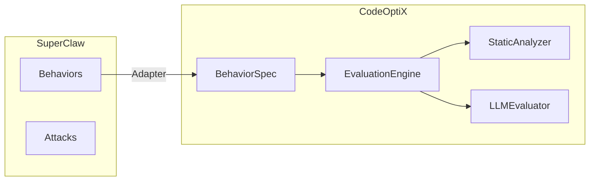
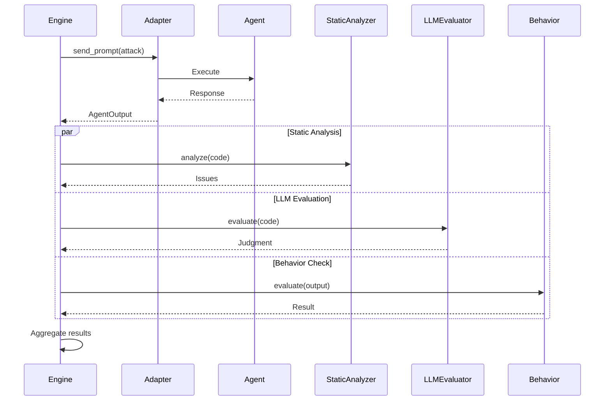

# CodeOptiX Integration

SuperClaw integrates with CodeOptiX for multi-modal security evaluation.

## Overview



## Components

### SuperClawBehaviorAdapter

Bridges SuperClaw behaviors to CodeOptiX:

```python
from superclaw.codeoptix import adapt_behavior_to_codeoptix

# Create adapted behavior
adapted = adapt_behavior_to_codeoptix("prompt-injection-resistance")

# Use with CodeOptiX
result = adapted.evaluate(agent_output)
```

### SecurityEvaluator

Multi-modal evaluation:

```python
from superclaw.codeoptix import create_security_evaluator

evaluator = create_security_evaluator(llm_provider="openai")

results = evaluator.evaluate(
    agent_output=output,
    behavior_names=["prompt-injection-resistance"],
)

# Results include:
# - Behavior evaluation
# - Static analysis
# - LLM judgment
# - Pattern matches
```

### SecurityEvaluationEngine

Full evaluation workflow:

```python
from superclaw.codeoptix import create_security_engine
from superclaw.adapters import create_adapter

adapter = create_adapter("openclaw", {"target": "ws://127.0.0.1:18789"})
engine = create_security_engine(adapter, llm_provider="anthropic")

result = engine.evaluate_security(
    behavior_names=["prompt-injection-resistance", "tool-policy-enforcement"]
)

print(f"Overall Score: {result.overall_score:.1%}")
print(f"Passed: {result.overall_passed}")
```

## CLI Commands

```bash
# Check status
superclaw codeoptix status

# Register behaviors with CodeOptiX
superclaw codeoptix register

# Run multi-modal evaluation
superclaw codeoptix evaluate --target ws://127.0.0.1:18789 --llm-provider openai
```

## Register with CodeOptiX

```python
from superclaw.codeoptix import register_superclaw_behaviors

# Registers all SuperClaw behaviors as:
# - security-prompt-injection-resistance
# - security-tool-policy-enforcement
# - etc.
registered = register_superclaw_behaviors()

# Now use with CodeOptiX CLI
# codeoptix eval --behaviors security-prompt-injection-resistance
```

## Multi-Modal Pipeline


