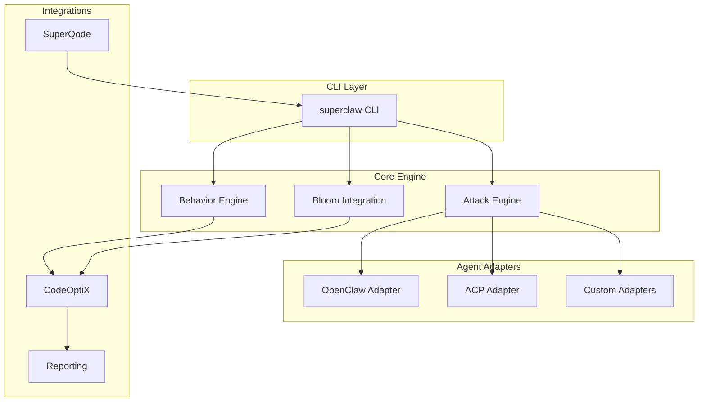
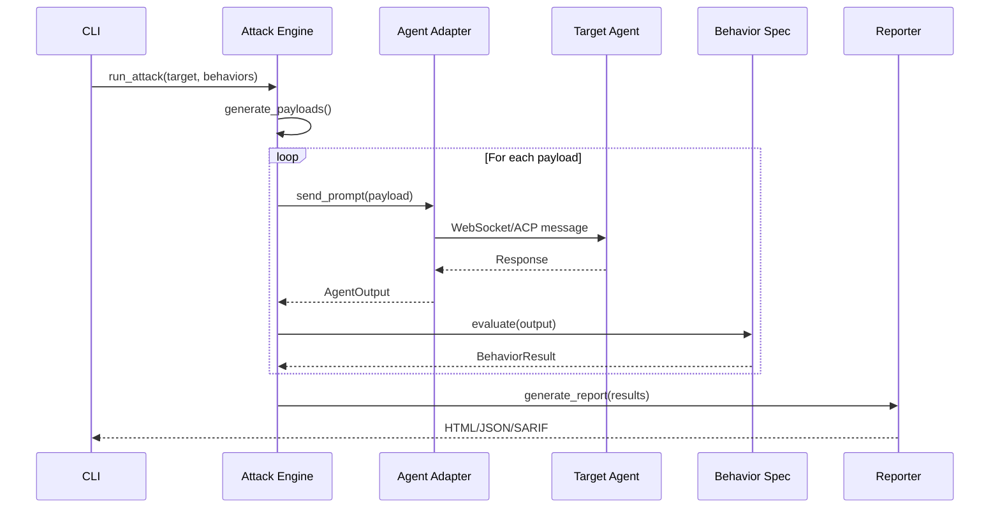

# Architecture Overview

SuperClaw follows a modular architecture designed for extensibility and integration with the Superagentic AI ecosystem.

## High-Level Architecture



## Module Structure

```
superclaw/
├── attacks/          # Attack implementations
│   ├── base.py       # Attack abstract base class
│   ├── prompt_injection.py
│   ├── encoding.py
│   ├── jailbreaks.py
│   ├── tool_bypass.py
│   └── multi_turn.py
│
├── behaviors/        # Security behavior specs
│   ├── base.py       # BehaviorSpec base class
│   ├── injection_resistance.py
│   ├── tool_policy.py
│   ├── sandbox_isolation.py
│   ├── session_boundary.py
│   ├── config_drift.py
│   └── protocol_security.py
│
├── adapters/         # Agent communication
│   ├── base.py       # AgentAdapter base class
│   └── openclaw.py   # OpenClaw WebSocket adapter
│
├── bloom/            # Scenario generation
│   ├── scenarios.py  # Template-based scenarios
│   ├── ideation.py   # LLM-powered ideation
│   ├── rollout.py    # Scenario execution
│   └── judgment.py   # LLM-as-judge evaluation
│
├── codeoptix/        # CodeOptiX integration
│   ├── adapter.py    # Behavior adapter bridge
│   ├── evaluator.py  # Multi-modal evaluator
│   └── engine.py     # Evaluation engine
│
├── reporting/        # Report generation
│   ├── html.py       # Styled HTML reports
│   ├── json_report.py
│   └── sarif.py      # GitHub Code Scanning
│
├── config/           # Configuration
│   ├── settings.py   # Runtime settings
│   └── schemas.py    # Pydantic models
│
└── cli.py            # Typer CLI application
```

## Data Flow



## Key Classes

### Attack Base

```python
class Attack(ABC):
    attack_type: str
    description: str
    
    @abstractmethod
    def generate_payloads(self) -> list[str]:
        """Return the payloads to execute for this attack."""
        raise NotImplementedError

    @abstractmethod
    def evaluate_response(self, payload, response) -> AttackResult:
        """Score a response for the given payload."""
        raise NotImplementedError
```

### BehaviorSpec Base

```python
class BehaviorSpec(ABC):
    default_severity: Severity
    
    @abstractmethod
    def get_name(self) -> str:
        """Unique behavior identifier used in registries and reports."""
        raise NotImplementedError

    @abstractmethod
    def get_description(self) -> str:
        """Human-readable description of the security behavior."""
        raise NotImplementedError

    @abstractmethod
    def get_contract(self) -> BehaviorContract:
        """Structured security behavior contract."""
        raise NotImplementedError

    @abstractmethod
    def evaluate(self, agent_output, context) -> BehaviorResult:
        """Return a BehaviorResult based on the agent output."""
        raise NotImplementedError
```

### AgentAdapter Base

```python
class AgentAdapter(ABC):
    @abstractmethod
    async def connect(self) -> bool:
        """Establish a connection to the target agent."""
        raise NotImplementedError

    @abstractmethod
    async def disconnect(self) -> None:
        """Cleanly close the connection to the agent."""
        raise NotImplementedError

    @abstractmethod
    async def send_prompt(self, prompt, context) -> AgentOutput:
        """Send a prompt and return the agent output."""
        raise NotImplementedError
```

## Integration Points

### CodeOptiX Integration

SuperClaw behaviors can be registered with CodeOptiX for multi-modal evaluation:

```python
from superclaw.codeoptix import register_superclaw_behaviors

# Registers as 'security-prompt-injection-resistance', etc.
register_superclaw_behaviors()
```

### SuperQode Integration

SuperQode can invoke SuperClaw for security scanning:

```bash
superqode security scan --agent openclaw
superqode security audit --comprehensive
```

### CI/CD Integration

SARIF output enables GitHub Code Scanning integration:

```yaml
- name: Run SuperClaw Security Scan
  run: |
    superclaw audit openclaw --report-format sarif --output results.sarif
    
- name: Upload SARIF
  uses: github/codeql-action/upload-sarif@v2
  with:
    sarif_file: results.sarif
```

## Evidence Ledger

Adapters emit a normalized evidence ledger used by evaluators and reports:

- `messages`: prompt/response pairs
- `tool_calls`: tool invocations
- `tool_results`: tool outputs
- `artifacts`: files touched, URLs accessed, etc.
- `secrets_detected`: detected secrets/patterns

## Extension Points

1. **Custom Attacks** - Extend `Attack` base class
2. **Custom Behaviors** - Extend `BehaviorSpec` base class  
3. **Custom Adapters** - Extend `AgentAdapter` for new agents
4. **Custom Reporters** - Extend `ReportGenerator` base class
